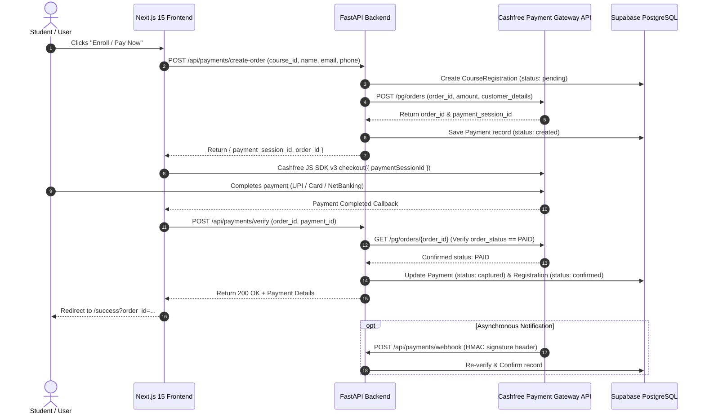

# Cashfree Payment Gateway Integration & Setup Guide

This guide explains the complete architecture, setup process, merchant portal onboarding, API credentials configuration, checkout flow, webhooks, and test credentials for **Cashfree Payment Gateway** ([merchant.cashfree.com](https://merchant.cashfree.com/)) in **InternVision Tech**.

---

## 1. Architecture Overview



---

## 2. Step-by-Step Merchant Account Setup

### Step 1: Create or Sign In to Cashfree Merchant Account
1. Visit the **Cashfree Merchant Dashboard**: [https://merchant.cashfree.com/](https://merchant.cashfree.com/)
2. Sign up or log into your merchant account.
3. Switch between **SANDBOX (Test Mode)** and **PRODUCTION (Live Mode)** using the environment toggle at the top of the dashboard.

---

### Step 2: Generate API Keys (App ID & Secret Key)
1. On the Cashfree Dashboard sidebar, navigate to **Payment Gateway** → **Developers** → **API Keys**.
2. Click **Generate API Keys** (or **Generate New Key**).
3. You will receive two credentials:
   - **App ID / Client ID** (e.g., `TEST10000000000000000000000001` for Sandbox or `1000000...` for Production).
   - **Secret Key** (e.g., `cfsk_ma_test_...` for Sandbox or `cfsk_ma_prod_...` for Production).

> [!CAUTION]
> Store your **Secret Key** securely! Never expose it in the frontend codebase or commit it to public version control.

---

### Step 3: Configure Webhook (Optional but Recommended)
1. In the Cashfree Dashboard, go to **Developers** → **Webhooks**.
2. Click **Add Webhook Endpoint**.
3. Set the Endpoint URL:
   ```text
   https://your-backend-domain.com/api/payments/webhook
   ```
4. Select the event: `PAYMENT_SUCCESS_WEBHOOK`, `PAYMENT_FAILED_WEBHOOK`, `ORDER_PAID`.
5. Cashfree automatically signs all outgoing webhooks using your `CASHFREE_SECRET_KEY` with HMAC-SHA256, verified by the FastAPI backend endpoint.

---

## 3. Environment Variables Configuration

### Backend Configuration (`backend/.env`):
Open `backend/.env` and update the Cashfree parameters:

```env
# ============================================================================
# CASHFREE PAYMENT GATEWAY CONFIGURATION
# ============================================================================
CASHFREE_APP_ID=your_cashfree_app_id_here
CASHFREE_SECRET_KEY=your_cashfree_secret_key_here
CASHFREE_ENVIRONMENT=sandbox          # Set to 'production' for live payments
CASHFREE_API_VERSION=2023-08-01        # Official API standard version
```

### Frontend Configuration (`frontend/.env.local`):
Open `frontend/.env.local` and add:

```env
# Cashfree SDK Mode ('sandbox' or 'production')
NEXT_PUBLIC_CASHFREE_MODE=sandbox
```

---

## 4. How the Code Works

### Backend Endpoints:
| Endpoint | Method | Description |
|---|---|---|
| `/api/payments/create-order` | `POST` | Creates a Cashfree Order on `https://sandbox.cashfree.com/pg/orders` and returns a `payment_session_id`. |
| `/api/payments/verify` | `POST` | Queries `https://sandbox.cashfree.com/pg/orders/{order_id}` to verify payment capture before confirming course registration. |
| `/api/payments/webhook` | `POST` | Asynchronously processes signed payment webhook events from Cashfree. |
| `/api/admin/payments` | `GET` | Superadmin financial transaction ledger with audit telemetry. |

### Frontend Checkout Integration:
The frontend loads the official Cashfree JS SDK v3 via [CashfreeScript.tsx](file:///c:/Users/tanis/Documents/iv/IV/frontend/src/components/CashfreeScript.tsx):
```html
<script src="https://sdk.cashfree.com/js/v3/cashfree.js"></script>
```

When triggering payment:
```typescript
// 1. Obtain session ID from backend
const data = await apiRequest("/payments/create-order", {
  method: "POST",
  body: JSON.stringify({
    course_id: course.id,
    student_name: name,
    student_email: email,
    student_phone: phone,
  }),
});

// 2. Initialize Cashfree SDK
const cashfree = window.Cashfree({
  mode: process.env.NEXT_PUBLIC_CASHFREE_MODE || "sandbox",
});

// 3. Open Cashfree Checkout Modal
cashfree.checkout({
  paymentSessionId: data.payment_session_id,
  redirectTarget: "_modal", // or "_self"
}).then(async (result) => {
  if (result.paymentDetails) {
    // 4. Verify on backend
    await apiRequest("/payments/verify", {
      method: "POST",
      body: JSON.stringify({
        order_id: data.order_id,
      }),
    });
    router.push(`/success?order_id=${data.order_id}`);
  }
});
```

---

## 5. Cashfree Sandbox Test Credentials

When testing in `sandbox` mode (`CASHFREE_ENVIRONMENT=sandbox`), you can use test payment details:

### 1. Test UPI:
- **UPI ID / VPA**: `success@upi` (Simulates instant successful payment)
- **UPI ID / VPA**: `failure@upi` (Simulates failed payment)

### 2. Test Cards:
| Card Number | Expiry | CVV | OTP / Result |
|---|---|---|---|
| `4711 1111 1111 1111` | Any future date (e.g. `12/30`) | `123` | Any 6-digit OTP (e.g., `123456`) → **Success** |
| `4000 0000 0000 0002` | Any future date (e.g. `12/30`) | `123` | Fails transaction simulation |

### 3. Test NetBanking:
- Select any test bank (e.g., **Test Bank**) → Choose **Success** on the mock bank redirect screen.

---

## 6. Going Live Checklist

When ready to collect real payments from real students:
1. Complete Business KYC on [https://merchant.cashfree.com/](https://merchant.cashfree.com/).
2. Switch dashboard toggle to **PRODUCTION**.
3. Generate **Production API Keys** (App ID and Secret Key).
4. Update `backend/.env`:
   ```env
   CASHFREE_APP_ID=your_production_app_id
   CASHFREE_SECRET_KEY=your_production_secret_key
   CASHFREE_ENVIRONMENT=production
   ```
5. Update `frontend/.env.local`:
   ```env
   NEXT_PUBLIC_CASHFREE_MODE=production
   ```
6. Deploy and test with a nominal payment (e.g. ₹1.00).
